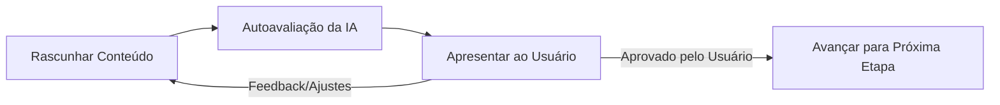

# Ciclo de Vida da Especificação (Spec Lifecycle)

Este documento define o processo estruturado e as etapas de validação pelas quais o ciclo de vida de qualquer especificação passará. Embora este repositório contenha a especificação do CaliForge como exemplo prático de modelagem de domínio, as etapas e portões abaixo são 100% agnósticos e projetados para guiar a estruturação de ideias de qualquer sistema de software antes de sua codificação.

> [!IMPORTANT]
> **Regra de Código de Produção Zero no Repositório:** Por ser um repositório focado puramente em infraestrutura de processo e design do ciclo de vida das especificações (Spec Engine), **nenhum código de produção operável (código-fonte de aplicativos, componentes ou lógica de frontend/backend) será escrito aqui**. Em projetos reais que utilizarem este framework via Skill, a codificação é proibida até que a especificação atinja a aprovação completa (Etapa 3 concluída pelo usuário).

---

## 🔁 Fluxo de Validação da Etapa

Para cada etapa, o agente e o usuário trabalharão em um loop iterativo:

Uma etapa só é considerada **concluída** quando todos os itens do seu checklist forem validados e aprovados pelo usuário.

> [!IMPORTANT]
> **Bloqueio por Perguntas Pendentes e Regras de Assinatura de Checklists:**
> A IA é estritamente proibida de marcar caixas de checklists de validação de etapas (mudar `- [ ]` para `- [x]`) ou autorizar passagens de fase sem que cumpra cumulativamente os seguintes portões de validação:
> 1. **Consentimento Explícito:** Validação verbal explícita de aprovação por parte do usuário no chat (ex: *"concordo"*, *"aprovo"*, *"de acordo"*).
> 2. **Questions Tracker Limpo:** Ausência total de perguntas ativas ou pendentes correspondentes àquela fase no arquivo **[questions.md](file:///home/lucas/github/trabalho-ai-t2/idea-organize/questions.md)**.
> 3. **Registro de Progresso:** Registro de auditoria do progresso e decisões de transição devidamente gravados no arquivo `context.jsonl` na raiz.
>
> A IA é estritamente proibida de assumir premissas ou dar por respondidas questões sem a manifestação inequívoca do usuário.

---

## ⚖️ Gestão de Densidade de Contexto e Escopo (Token Economy & Focus)

Para evitar o crescimento descontrolado das especificações (token bloat) e garantir que os agentes de IA mantenham o foco absoluto nos requisitos prioritários, aplicamos duas regras de governança de escopo:

1. **Triagem Ativa de Ideias e Bifurcações:**
   - Sempre que novas ideias, casos de borda secundários ou extensões de domínio forem levantados, a IA deve questionar verbalmente o usuário se o item é **prioritário e essencial para o objetivo principal** ou se é uma **ideia secundária/futura**.
   - **Mapeamento de Ideias Futuras:** Itens classificados como secundários **não** entram na especificação ativa. Eles são consolidados no arquivo [future-specs.md](file:///home/lucas/github/trabalho-ai-t2/idea-organize/future-specs.md), onde são ordenados por relevância e mantidos como backlog estruturado para discussões futuras.

2. **Protocolo de Modularização de Módulos Satélites:**
   - Se uma regra ou subsistema prioritário exigir detalhamento profundo (ex: mais de 3 casos de borda complexos ou regras de negócio extensas), a especificação principal (como o [active_spec.md](file:///home/lucas/github/trabalho-ai-t2/idea-organize/active_spec.md)) mapeará apenas a arquitetura geral e os contratos.
   - O detalhamento exaustivo deve ser isolado em arquivos de módulos satélites sob o diretório `idea-organize/modules/` (ex: `idea-organize/modules/rehabilitation.md`), referenciados de forma limpa na especificação principal.

---

## 📌 Etapas do Ciclo de Vida

### 🏁 Etapa 1: Objetivo e Escopo do Projeto (Goal & Scope)
* **Objetivo:** Definir claramente o propósito do projeto, os problemas que ele resolve, os objetivos de uso, o público-alvo (personas) e os limites de escopo (recursos inclusos e exclusos).
* **Checklist de Validação:**
  - [ ] Objetivo geral e público-alvo (personas) bem delimitados.
  - [ ] Escopo de recursos e funcionalidades acordado (entregas centrais).
  - [ ] Restrições gerais e limitações de uso mapeadas.

### 📐 Etapa 2: Requisitos do Projeto / Sistema (System Requirements)
* **Objetivo:** Detalhar os requisitos de negócio e funcionais do sistema, as regras de comportamento, a lógica que governa as operações da aplicação e a jornada ou fluxos principais de interação.
* **Checklist de Validação:**
  - [ ] Requisitos funcionais (comportamentos esperados) detalhados.
  - [ ] Regras de negócio, restrições lógicas e adaptações de domínio consolidadas.
  - [ ] Jornada do usuário, casos de uso principais e fluxos de interação mapeados de forma clara.

### 🧪 Etapa 3: Critérios de Aceitação (Acceptance Criteria)
* **Objetivo:** Estabelecer as condições claras e objetivas (critérios de aceitação binários: Passa / Não Passa) sob as quais cada funcionalidade ou requisito será validado como concluído e correto.
* **Checklist de Validação:**
  - [ ] Critérios de aceitação objetivos estabelecidos para cada requisito chave do sistema.
  - [ ] Mapeamento e tratamento de cenários de exceção e falhas.
  - [ ] Lógica conceitual de conformidade validada em conjunto com o usuário.
