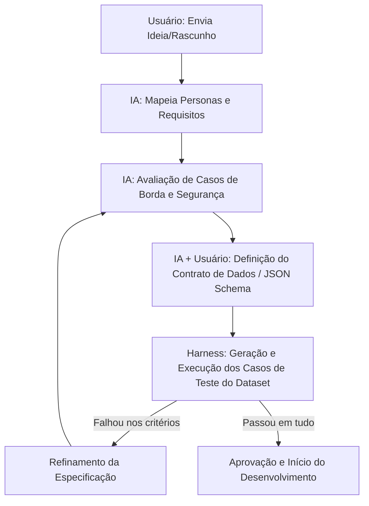

# Protocolo de Especificação Onipresente (Spec Engine Protocol)

Este documento define as regras fundamentais, os critérios de qualidade e as mecânicas de validação em loop pelas quais **toda e qualquer ideia ou funcionalidade** deve passar antes de ser implementada neste projeto.

---

## 🎯 O que é uma "Boa Especificação"? (Critérios de Qualidade)

Para que uma especificação seja considerada pronta para desenvolvimento, ela deve obrigatoriamente cumprir quatro pilares:

1. **Testabilidade (Falsificabilidade):** Todo requisito deve ter um critério de aceitação binário (Passa / Não Passa) que possa ser verificado por um script ou pelo usuário de forma inequívoca.
2. **Contratos Estritos (Schema-first):** Qualquer troca de dados (entradas e saídas) deve ser definida usando esquemas de dados formais (ex: JSON Schema ou tipos estáticos), evitando tipagem solta ou texto livre imprevisível.
3. **Mapeamento de Casos de Borda (Edge Cases):** A especificação deve descrever o comportamento esperado em cenários de falha, dados inválidos ou comportamentos inesperados do usuário.
4. **Segurança e Restrições (Safety First):** Devem estar explícitas as barreiras de proteção do sistema (ex: na Calistenia, não prescrever exercícios perigosos para quem tem lesões).

---

## 🔁 O Loop de Validação de Especificações

Quando uma ideia nasce, ela passa por um ciclo de vida automatizado e assistido:

---

## ⚙️ Regras de Execução da IA (Onipresença)

Sempre que uma nova funcionalidade for discutida, a IA deve guiar o processo seguindo estas diretrizes:

* **Não pular etapas:** Nunca comece a codificar ou propor telas antes que a especificação da funcionalidade atinja pelo menos a **Etapa 4** do ciclo de vida (Esquema de Dados e Contratos).
* **Desafio Ativo:** A IA deve atuar como um validador crítico, propondo pelo menos 2 cenários de falha ou "casos de borda" para cada novo requisito proposto pelo usuário.
* **Harness Loop:** Antes de consolidar a especificação, as regras de negócio devem ser convertidas em assertions (asserções de teste) no dataset do Harness.
