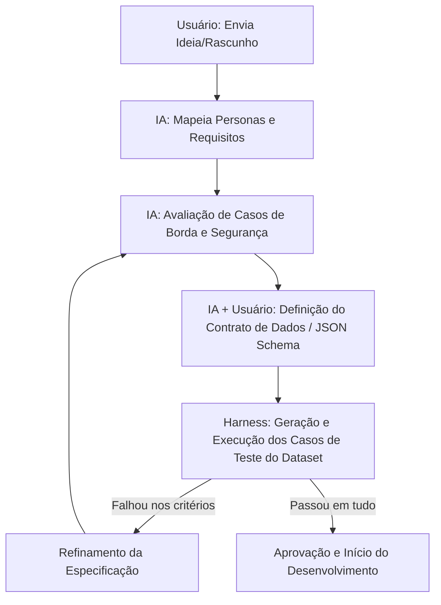

# Protocolo de Especificação Onipresente (Spec Engine Protocol)

Este repositório atua como um **Framework de Especificação (Spec Engine)**. O seu objetivo principal é estruturar o processo e o ciclo de vida pelos quais qualquer ideia de produto ou melhoria técnica deve passar antes de ser codificada em projetos futuros.

O diretório `specs/` serve exclusivamente para a modelagem conceitual, prosa e documentação de especificações. É terminantemente proibido escrever ou gerar qualquer linha de código executável ou scripts dentro de `specs/`. A codificação da aplicação é uma atividade externa ao processo de especificação e só deve ser iniciada após as especificações serem homologadas e assinadas pelo usuário. No futuro, este framework servirá como uma Skill Customizada (`new-spec`) que impedirá os agentes de IA de iniciar qualquer desenvolvimento sem que haja uma especificação formal previamente aprovada pelo usuário.

---

## 🎯 O que é uma "Boa Especificação"? (Critérios de Qualidade)

Para que uma especificação seja considerada pronta para desenvolvimento, ela deve obrigatoriamente cumprir quatro pilares:

1. **Testabilidade (Falsificabilidade):** Todo requisito deve ter um critério de aceitação binário (Passa / Não Passa) que possa ser verificado por um script ou pelo usuário de forma inequívoca.
2. **Contratos Estritos (Schema-first):** Qualquer troca de dados (entradas e saídas) deve ser definida usando esquemas de dados formais (ex: JSON Schema ou tipos estáticos), evitando tipagem solta ou texto livre imprevisível.
3. **Mapeamento de Casos de Borda (Edge Cases):** A especificação deve descrever o comportamento esperado em cenários de falha, dados inválidos ou comportamentos inesperados do usuário.
4. **Segurança e Restrições (Safety First):** Devem estar explícitas as barreiras de proteção do sistema (ex: na Calistenia, não prescrever exercícios perigosos para quem tem lesões).

---

## 🔁 O Loop de Validação de Especificações

Quando uma ideia nasce, ela passa por um ciclo de vida automatizado e assistido:

---

## ⚙️ Regras de Execução da IA (Onipresença)

Sempre que uma nova funcionalidade for discutida, a IA deve guiar o processo seguindo estas diretrizes:

* **Proibição Absoluta de Código em Specs:** Nenhuma linha de código de aplicação, lógica de desenvolvimento ou interfaces operáveis serão geradas dentro do diretório `specs/`. O processo de especificação neste diretório é estritamente conceitual e em prosa. O desenvolvimento do software é uma fase posterior e externa que só é liberada quando as especificações atingirem 100% de aprovação (Etapa 5 concluída no Harness e assinada).
* **Não pular etapas:** Nunca comece a propor implementações ou telas de produção antes que a especificação atinja a aprovação completa.
* **Desafio Ativo:** A IA deve atuar como um validador crítico, propondo pelo menos 2 cenários de falha ou "casos de borda" para cada novo requisito proposto pelo usuário.
* **Harness Loop:** Antes de consolidar a especificação, as regras de negócio devem ser convertidas em assertions (asserções de teste) no dataset do Harness.
* **Registro de Melhorias (Improvements Tracker):** Qualquer ponto de melhoria ou refinamento estrutural no ciclo de vida (lifecycle) deve ser documentado no arquivo [improvements-framework.md](file:///home/lucas/github/trabalho-ai-t2/specs/improvements-framework.md) neste diretório de specs, servindo como instrução local focada em refinar a estrutura do framework. **Este registro de melhorias deve conter apenas aprimoramentos do meta-processo, sendo estritamente proibida a inclusão de regras de negócio de produtos ativos.**
* **Tracker de Perguntas (Questions Tracker):** Toda e qualquer pergunta feita ao usuário durante o ciclo de vida deve ser registrada no arquivo [questions.md](file:///home/lucas/github/trabalho-ai-t2/specs/questions.md). Nenhuma etapa do checklist pode ser concluída e nenhuma dedução/afirmação pode ser assumida até que todas as respectivas perguntas ativas no tracker sejam respondidas pelo usuário.
* **Geração de Entregáveis de Engenharia (Portão Final):** A criação e preenchimento dos arquivos de documentação técnica do projeto (`projeto.md`, `requisitos.md` e `criterios-aceite.md`) são **estritamente proibidas** até que a especificação atinja a aprovação final (Etapa 5 concluída e assinada). Quando autorizados, esses arquivos serão obrigatoriamente gerados e mantidos no diretório [specs/output/](file:///home/lucas/github/trabalho-ai-t2/specs/output/).

