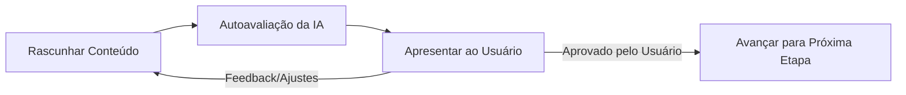

# Ciclo de Vida da Especificação (Spec Lifecycle)

Este documento define o processo estruturado e as etapas de validação pelas quais a especificação da nossa solução de calistenia passará. O desenvolvimento é orientado por etapas sequenciais com loops de verificação.

---

## 🔁 Fluxo de Validação da Etapa

Para cada etapa, o agente e o usuário trabalharão em um loop iterativo:

Uma etapa só é considerada **concluída** quando todos os itens do seu checklist forem validados e aprovados pelo usuário.

---

## 📌 Etapas do Ciclo de Vida

### 🏁 Etapa 1: Visão Geral e Escopo (Ideation & Product Vision)
* **Objetivo:** Definir o público-alvo, personas, e o escopo funcional básico (Geração de Treinos, Progressão, Acompanhamento).
* **Checklist de Validação:**
  - [ ] Persona do usuário bem definida (iniciante vs. avançado).
  - [ ] Escopo funcional acordado (recursos indispensáveis vs. secundários).
  - [ ] Restrições físicas e de equipamentos mapeadas.

### 📐 Etapa 2: Modelo de Domínio e Progressão (Domain & Progressions)
* **Objetivo:** Definir os exercícios de calistenia suportados, sua hierarquia de dificuldade (progressão) e regras de treino.
* **Checklist de Validação:**
  - [ ] Mapeamento de exercícios principais (Empurrar, Puxar, Pernas, Core).
  - [ ] Tabela de progressão de exercícios detalhada por nível.
  - [ ] Regra de sobrecarga progressiva estruturada para o algoritmo.

### 🖥️ Etapa 3: Especificação de UI/UX e Design System
* **Objetivo:** Planejar a interface do usuário, navegação, paleta de cores (HSL) e transições premium.
* **Checklist de Validação:**
  - [ ] Fluxo de telas (Onboarding, Dashboard, Treino Ativo, Histórico).
  - [ ] Design tokens (cores primárias/secundárias, tipografia, espaçamentos).
  - [ ] Planejamento de animações e micro-interações.

### 💾 Etapa 4: Esquemas de Dados e Contratos (Data Schema)
* **Objetivo:** Formalizar as estruturas de entrada e saída (JSON Schemas) que o Agente de IA e o Harness usarão.
* **Checklist de Validação:**
  - [ ] Esquema JSON de Entrada (Perfil do Usuário, Equipamentos, Objetivo).
  - [ ] Esquema JSON de Saída (Estrutura do Treino Gerado).
  - [ ] Definição das validações sintáticas.

### 🧪 Etapa 5: Critérios de Avaliação e Dataset do Harness
* **Objetivo:** Definir os cenários de teste reais que o Harness rodará para avaliar a qualidade dos treinos gerados pela IA.
* **Checklist de Validação:**
  - [ ] Dataset com pelo menos 5 cenários diversos de usuários.
  - [ ] Critérios de avaliação objetivos (ex: segurança, volume de treino, formato).
  - [ ] Lógica de asserção para o script de avaliação.
