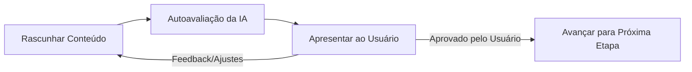

# Ciclo de Vida da Especificação (Spec Lifecycle)

Este documento define o processo estruturado e as etapas de validação pelas quais o ciclo de vida de qualquer especificação passará. Usamos a especificação da calistenia (CaliForge) como o nosso caso de uso de referência para estruturar este framework.

> [!IMPORTANT]
> **Regra de Código de Produção Zero no Repositório:** Por ser um repositório focado puramente em infraestrutura de processo e design do ciclo de vida das especificações (Spec Engine), **nenhum código de produção operável (código-fonte de aplicativos, componentes ou lógica de frontend/backend) será escrito aqui**. Em projetos reais que utilizarem este framework via Skill, a codificação é proibida até que a especificação atinja a aprovação no Harness.

---

## 🔁 Fluxo de Validação da Etapa

Para cada etapa, o agente e o usuário trabalharão em um loop iterativo:

Uma etapa só é considerada **concluída** quando todos os itens do seu checklist forem validados e aprovados pelo usuário.

> [!IMPORTANT]
> **Bloqueio por Perguntas Pendentes e Regras de Assinatura de Checklists:**
> A IA é estritamente proibida de marcar caixas de checklists de validação de etapas (mudar `- [ ]` para `- [x]`) ou autorizar passagens de fase sem que cumpra cumulativamente os seguintes portões de validação:
> 1. **Consentimento Explícito:** Validação verbal explícita de aprovação por parte do usuário no chat (ex: *"concordo"*, *"aprovo"*, *"de acordo"*).
> 2. **Questions Tracker Limpo:** Ausência total de perguntas ativas ou pendentes correspondentes àquela fase no arquivo **[questions.md](file:///home/lucas/github/trabalho-ai-t2/specs/questions.md)**.
> 3. **Registro de Progresso:** Registro de auditoria do progresso e decisões de transição devidamente gravados no arquivo `context.jsonl` na raiz.
>
> A IA é estritamente proibida de assumir premissas ou dar por respondidas questões sem a manifestação inequívoca do usuário.

---

## ⚖️ Gestão de Densidade de Contexto e Escopo (Token Economy & Focus)

Para evitar o crescimento descontrolado das especificações (token bloat) e garantir que os agentes de IA mantenham o foco absoluto nos requisitos prioritários, aplicamos duas regras de governança de escopo:

1. **Triagem Ativa de Ideias e Bifurcações:**
   - Sempre que novas ideias, casos de borda secundários ou extensões de domínio forem levantados, a IA deve questionar verbalmente o usuário se o item é **prioritário e essencial para o objetivo principal** ou se é uma **ideia secundária/futura**.
   - **Mapeamento de Ideias Futuras:** Itens classificados como secundários **não** entram na especificação ativa. Eles são consolidados no arquivo [future-specs.md](file:///home/lucas/github/trabalho-ai-t2/specs/future-specs.md), onde são ordenados por relevância e mantidos como backlog estruturado para discussões futuras.

2. **Protocolo de Modularização de Módulos Satélites:**
   - Se uma regra ou subsistema prioritário exigir detalhamento profundo (ex: mais de 3 casos de borda complexos ou regras de negócio extensas), a especificação principal (como o [active_spec.md](file:///home/lucas/github/trabalho-ai-t2/specs/active_spec.md)) mapeará apenas a arquitetura geral e os contratos.
   - O detalhamento exaustivo deve ser isolado em arquivos de módulos satélites sob o diretório `specs/modules/` (ex: `specs/modules/rehabilitation.md`), referenciados de forma limpa na especificação principal.

---

## 📌 Etapas do Ciclo de Vida

### 🏁 Etapa 1: Visão Geral e Escopo (Ideation & Product Vision)
* **Objetivo:** Definir o público-alvo, personas, o escopo funcional básico e a **Massa Crítica de Dados (Estado Mínimo)** necessária para o funcionamento de fluxos de dados incrementais.
* **Checklist de Validação:**
  - [ ] Persona do usuário bem definida (iniciante vs. avançado).
  - [ ] Escopo funcional acordado (recursos indispensáveis vs. secundários).
  - [ ] Restrições físicas e de equipamentos mapeadas.
  - [ ] Massa crítica (dados de entrada mínimos obrigatórios) definida formalmente para o caso de fluxos de coleta progressiva.

### 📐 Etapa 2: Modelo de Domínio e Progressão (Domain & Progressions)
* **Objetivo:** Definir os exercícios de calistenia suportados, sua hierarquia de dificuldade (progressão) e regras de treino.
* **Checklist de Validação:**
  - [ ] Mapeamento de exercícios principais (Empurrar, Puxar, Pernas, Core).
  - [ ] Tabela de progressão de exercícios detalhada por nível.
  - [ ] Regra de sobrecarga progressiva estruturada para o algoritmo.

### 🖥️ Etapa 3: Especificação de UI/UX e Design System
* **Objetivo:** Planejar a interface do usuário, navegação, paleta de cores (HSL) e transições premium.
* **Checklist de Validação:**
  - [ ] Fluxo de telas (Onboarding, Dashboard, Treino Ativo, Histórico).
  - [ ] Design tokens (cores primárias/secundárias, tipografia, espaçamentos).
  - [ ] Planejamento de animações e micro-interações.

### 💾 Etapa 4: Esquemas de Dados e Contratos (Data Schema)
* **Objetivo:** Formalizar as estruturas de entrada e saída (JSON Schemas) que o Agente de IA e o Harness usarão, definindo fallbacks de segurança e regras temporais para os dados.
* **Checklist de Validação:**
  - [ ] Esquema JSON de Entrada (Perfil do Usuário, Equipamentos, Objetivo).
  - [ ] Esquema JSON de Saída (Estrutura do Treino Gerado).
  - [ ] Definição das validações sintáticas.
  - [ ] Mapeamento e documentação de valores padrões seguros (fallbacks) para todos os parâmetros de dados opcionais ou incompletos.
  - [ ] Definição do ciclo de vida, expiração e regras de decaimento para variáveis mutáveis ou dependentes do tempo (dados temporais).

### 🧪 Etapa 5: Critérios de Avaliação e Dataset do Harness
* **Objetivo:** Definir os cenários de teste reais que o Harness rodará para avaliar a qualidade dos treinos gerados pela IA.
* **Checklist de Validação:**
  - [ ] Dataset com pelo menos 5 cenários diversos de usuários.
  - [ ] Critérios de avaliação objetivos (ex: segurança, volume de treino, formato).
  - [ ] Lógica de asserção para o script de avaliação.

---

## 🎁 Entregáveis Finais de Engenharia (Output de Desenvolvimento)

Ao concluir com sucesso a **Etapa 5** (Asserções de testes verdes no Harness), a especificação é considerada finalizada. O framework autoriza e exige que a IA crie e popule os seguintes documentos técnicos de entrega sob o diretório [specs/output/](file:///home/lucas/github/trabalho-ai-t2/specs/output/):

1. **[projeto.md](file:///home/lucas/github/trabalho-ai-t2/specs/output/projeto.md):** Contém a especificação geral do produto, incluindo a descrição do problema a ser resolvido, objetivos principais, restrições e escopo macro.
2. **[requisitos.md](file:///home/lucas/github/trabalho-ai-t2/specs/output/requisitos.md):** Contém a lista estruturada e detalhada de todos os requisitos funcionais (RFs) e não-funcionais (RNFs) mapeados na especificação.
3. **[criterios-aceite.md](file:///home/lucas/github/trabalho-ai-t2/specs/output/criterios-aceite.md):** Contém a descrição detalhada de todos os critérios de aceitação e testes manuais/automatizados a serem executados para validar o produto.
