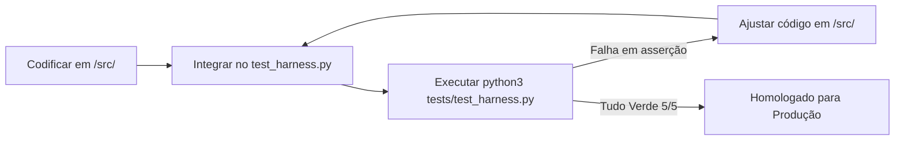

# CaliForge Source Directory (src/)

Este diretório contém o código-fonte de produção da aplicação **CaliForge**, desenvolvido em estrita conformidade com a metodologia **Spec-Driven Development (SDD)**.

---

## 🔁 Fluxo de Desenvolvimento e Integração com o Harness

Para garantir a segurança física e a qualidade do algoritmo de prescrição de calistenia, a codificação segue um fluxo em loop fechado guiado por testes:



### 1. Diretrizes para o Desenvolvimento de Código em `/src/`
* **Entrada de Dados:** Toda função de entrada de dados do usuário deve ser compatível com as regras de massa crítica e fallbacks seguros e validar contra o JSON Schema [CaliForgeUserInput.json](file:///home/lucas/github/trabalho-ai-t2/tests/schemas/CaliForgeUserInput.json).
* **Lógica do Algoritmo de Treino:** Deve implementar com exatidão as regras contidas em [requisitos.md](file:///home/lucas/github/trabalho-ai-t2/specs/output/requisitos.md):
  - **Evolução Colaborativa:** Análise de consistência e check-in dinâmico por chat.
  - **Pain Lockout:** Bloqueio sumário de exercícios agressores se dor articular for maior ou igual a 3.
  - **Frequência e Volume:** Controle de volume regenerativo se consistência semanal for baixa (< 2 treinos).
  - **Equilíbrio Anatômico:** Manter a relação push/pull entre 0.8 e 1.2 nos treinos fullbody.
* **Saída de Dados:** O treino gerado deve respeitar o contrato estrito definido em [CaliForgeWorkoutOutput.json](file:///home/lucas/github/trabalho-ai-t2/tests/schemas/CaliForgeWorkoutOutput.json).

---

## 🧪 Como Validar o Código de Produção (Harness Loop)

1. **Acoplamento do Código ao Harness:**
   No arquivo [tests/test_harness.py](file:///home/lucas/github/trabalho-ai-t2/tests/test_harness.py), substitua a chamada do mock pela importação direta do algoritmo do `/src/`:
   ```python
   # Exemplo: importar o gerador real do src
   from src.generator import generate_workout
   
   # No runner de testes, chame a função real:
   workout = generate_workout(user_input)
   ```

2. **Executar a Suite de Testes:**
   Na raiz do projeto, execute o script do Harness:
   ```bash
   python3 tests/test_harness.py
   ```

3. **Verificação de Sucesso:**
   O código só será considerado homologado quando o Harness atestar o resultado **"TUDO VERDE! (5/5 Casos de Teste Passando)"**.

---

## 🚫 Regras Críticas de Governança

* **Encapsulamento do specs/:** É terminantemente proibido escrever código executável, classes ou lógica da aplicação dentro do diretório `/specs/`. A pasta `/specs/` é reservada exclusivamente para modelagem conceitual em prosa.
* **Encapsulamento do tests/:** A pasta `/tests/` deve conter apenas os dados de testes (`dataset.json`), schemas de validação e o runner (`test_harness.py`). Toda a lógica computacional do CaliForge deve residir no `/src/`.
